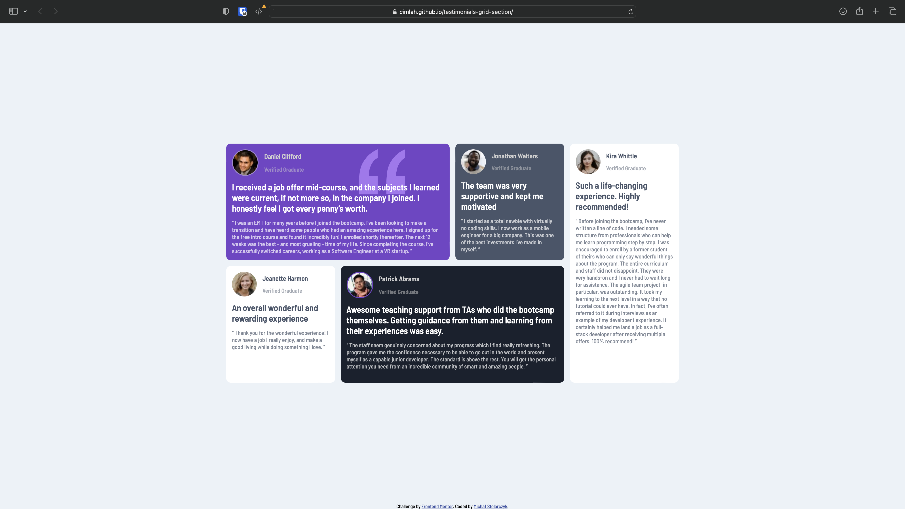

# Frontend Mentor - Testimonials grid section solution

This is a solution to the [Testimonials grid section challenge on Frontend Mentor](https://www.frontendmentor.io/challenges/testimonials-grid-section-Nnw6J7Un7). Frontend Mentor challenges help you improve your coding skills by building realistic projects. 

## Table of contents

- [Overview](#overview)
  - [The challenge](#the-challenge)
  - [Screenshot](#screenshot)
  - [Links](#links)
- [Author](#author)
- [Acknowledgments](#acknowledgments)

## Overview

### The challenge

Users should be able to:

- View the optimal layout for the site depending on their device's screen size

### Screenshot

### Links

- [Solution URL](https://www.frontendmentor.io/solutions/testimonials-grid-section-with-css-grid-5jV7UDV-0w)
- [Live Site URL](https://cimlah.github.io/testimonials-grid-section/)

## Author

- Website - [Michał Stolarczyk](https://github.com/Cimlah)
- Frontend Mentor - [@Cimlah](https://www.frontendmentor.io/profile/Cimlah)

## Acknowledgments

Thank you, [lemmoor](https://github.com/lemmoor) for help and giving motivation by challenging me to do this project.